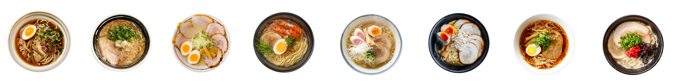

# Ichiraku Ramen 🍜

**Ichiraku Ramen** is a website project designed to bring the vibrant world of Japanese ramen culture online. With an attractive and user-friendly interface, the site highlights various ramen dishes, offers an immersive user experience, and provides contact information for the restaurant.

## 🌐 Live Demo

Check out the live demo: [Ichiraku Ramen Website](https://kirtanpatel01.github.io/ARKA_WD_01/)

## 📁 Repository

You can find the codebase here: [GitHub Repository](https://github.com/kirtanpatel01/ARKA_WD_01/)

## 🚀 Features

- **Interactive Navbar**: The website includes a responsive navigation bar with links to different sections such as Home, Menu, and About.
- **Home Section**: Welcomes visitors with a description of Ichiraku Ramen’s specialties.
- **Menu Section**: Showcases various ramen dishes with attractive images and detailed descriptions of each meal.
- **About Section**: Provides insight into the Ichiraku Ramen story, including a connection to Naruto, the beloved anime character.
- **Contact Section**: Includes the restaurant's email, phone number, and location for inquiries.
- **Responsive Design**: The website is designed to look great on both mobile and desktop devices.
- **Custom Font Integration**: Two custom fonts—Fredoka and Laviossa—are used to enhance the overall aesthetic.
- **Dynamic Hamburger Menu**: For smaller screens, a hamburger menu is available that can be toggled to show or hide the navigation items.

## 🖼️ Screenshots

### Home Section


### Menu Section


## 📦 Installation

To run the project locally:

1. Clone the repository:
   ```bash
   git clone https://github.com/kirtanpatel01/ARKA_WD_01.git
